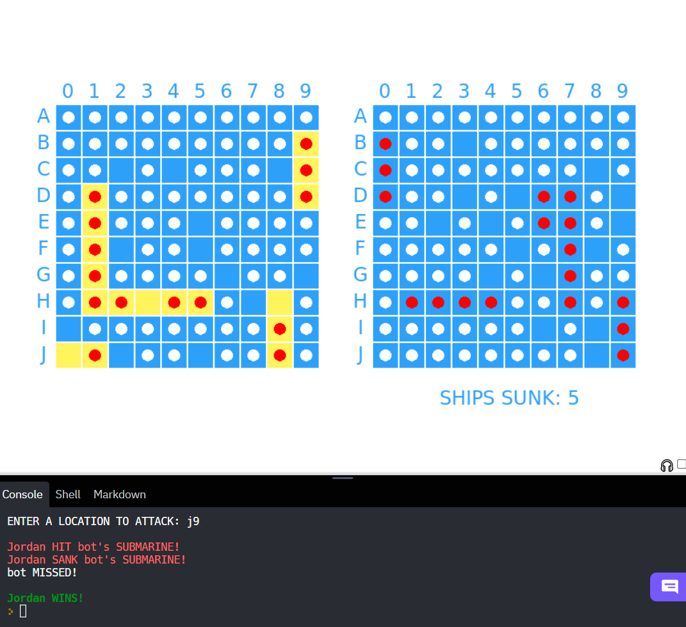

# Battleship by Ty'rese H. — June 2022


### GAME INSTRUCTIONS
Create a layout of ships and place them onto your ocean grid. Use your target grid to attack your opponent's ships and keep track of your shots. _Hit_ shots are marked by a red circle while _missed_ shots are marked by a white circle. Sink all of your opponents ships to win the game. Click [here](https://www.hasbro.com/common/instruct/battleship.pdf) for Hasbro's official rules. <br/>

As shown the game is one-player (versus a bot), but ```main()``` could be modified to make it two-player.<br/>



_See documentation and Replit file below._


### GLOBAL VARIABLES
```START_X``` and ```START_Y``` are the x-y coordinates needed to draw the a grid (with specific dimensions) in the middle of the screen.

```game_ships``` stores the names of the ships along with their lengths.

### VISUALS
Each 10x10 grid is made up squares. Blue squares represent empty ocean space, yellow squares represent ships. When a shot _misses_, the corresponding square is marked with a white circle. When a shot _hits_ a ship, the corresponding square is marked with a red circle.<br/>

```draw_square()``` draws a filled square at ```(x, y)```.<br/>
```draw_text()``` draws ```text``` at ```(x, y)```.<br/>
```draw_marker()``` draws a circle at ```(x, y)```.<br/>
```draw_board()``` draws ```board``` at ```(x, y)``` along with any necessary markers. The rows and columns are also labeled.<br/>
```draw_stats()``` draws the number of opponent ships a player has sunk thus far.


### PLAYERS AND GRIDS
The ```Player``` class manages players.<br/>

```self.ship_health``` is a copy of ```game_ships``` and keeps track of the health of a player's ships. If a ship's health reaches zero, that means the ship has been sunk.<br/>

```self.ships_sunk``` keeps track of how many opponent ships a player has sunk thus far.<br/>

```self.main_board``` and ```self.shot_board``` represent the _ocean grid_ and the _target grid_ in the Battleship game. Both grids are stored as 10x10 two-dimensional lists of string elements. Initially, all of the elements are ```"ocean"``` which represent empty ocean space. <br/>

When a ship is placed in ```self.main_board```, it is stored in individual elements. Those elements match the name of the ship that was placed. For example, when a _carrier_ ship (length five) is placed, five  ```"ocean"``` elements are replaced with ```"carrier"```.<br/>

If a player's ship is _hit_ by an opponent, ```"H"``` is concatenated to the end of the string that corresponds to the hit location in ```self.main_board```. For example, if a _destroyer_ ship is _hit_, ```"destroyer"``` becomes ```"destroyerH"```. If the opponent _misses_ however, ```"M"``` is concatenated and  ```"ocean"``` becomes ```"oceanM"```. When a player takes a shot at an opponent, the same convention follows in ```self.shot_board```, except there are no ships in ```self.shot_board```. All of the elements in it will be either ```"ocean"```, ```"oceanH"```, or ```"oceanM"```.


### PLACING SHIPS
To place a ship a player must choose a location for the front of the ship and a direction for the body to extend in. The input must be a letter representing the row, followed by a letter representing the column, followed by a whitespace, and then the chosen direction. For example, lets say a player chooses to place their _cruiser_ ship (length 3) at _A0 right_. Then ```self.main_board[0][0]```, ```self.main_board[0][1]```, and ```self.main_board[0][2]``` will be replaced with ```"cruiser"```.

```self.place_ship()``` is a **recursive** method that places the front of a ship ```ship_name``` of length ```n``` at ```self.main_board[row][col]``` and places the rest of the body based on ```direction```. **The base cases ensure that the chosen location and direction don't result in (1) placing the ship at a location out of range or (2) overwriting another ship.** If the ship has been successfuly placed, ```True``` is returned, otherwise ```False``` is returned.

```self.setup()``` iterates through all of the ships and asks the player to place each one. If a player inputs an invalid placement, an error message is shown. If optional parameter ```auto``` is ```True```, the ships will be randomly placed onto the grid. 


### ATTACKING
```self.attack()``` asks a player to attack a location on ```opponent```'s _ocean grid_. If a player enters an invalid location or tries to attack a previously attacked position, an error message is shown. If the player makes a valid attack, the method prints a message telling the player whether their shot was a _hit_ or _miss_. It also modifies ```self.shot_board``` and ```opponent.main_board``` using the convention mentioned above. If the attack is a _hit_, the corresponding opponent's ship loses health. If the opponent's ship's health is at zero, ```self.ships_sunk``` is incremented.


### MAIN GAME CONTROL
The ```main()``` function runs the game. The ```game_over()``` function returns ```True``` if either player has won by sinking all of the other player's ships. It returns ```False``` otherwise.

### RUN IT YOURSELF
**Fork this repl to test it since the console must be used to play the game.**<br/>
**[Click here to test this game on replit.](https://replit.com/@ty-rese/Battleship#main.py)**
**If you find any bugs, please email me at htd.7z@my.com**
